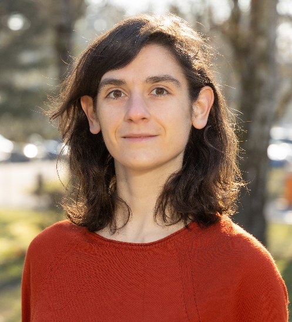

# Ariane Soret - Personal Website 

--- 

- [About](#about)
- [Papers](#papers)
- [Videos](#videos)
- [Teaching and outreach activities](#teaching-and-outreach-activities)

--- 
 
##   About Me 
I am a research scientist at the [University of Luxembourg](https://www.uni.lu/fstm-en/research-departments/department-of-physics-materials-science/), in the group of [Prof. Massimiliano Esposito](https://sites.google.com/site/massimilianoespositogennaro/home). My research interests include quantum thermodynamics, quantum optics, mesoscopic physics, statistical mechanics and many-body quantum systems. The common denominator of my research accross these fields is the study of light far from equilibrium, in classical, semi-classical and quantum models. My latest works focus on adapting the methods of stochastic thermodynamics to study energy fluctuations of photons interacting with quantum systems, in particular in far from equilibrium regimes and non linear regimes.  
In terms of methods, I resort to counting statistics, master equations, quantum dynamical semigroups, Green's functions, diagrammatic approaches, larges deviations and paths integrals techniques.

A complete CV in <a href="/CV_Soret_english.pdf"> PDF.

---
 
## Papers

Here are some of my papers which illustrate each of my research interests, past and present. The complete list of my publications is on my [Google Scholar](https://scholar.google.com/citations?view_op=list_works&hl=fr&hl=fr&user=u_wKph8AAAAJ) page.

- [AS, V. Cavina, M. Esposito, "Thermodynamic consistency of quantum master equations"](https://journals.aps.org/pra/abstract/10.1103/PhysRevA.106.062209): this technical work explores the conditions under which quantum master equations are thermodynamically consistent, i.e., preserve the laws of thermodynamics and fluctuation theorems. A new quantum detailed balance is identified as necessary condition, which coincides which usual notions of detail balance under strict energy conservation requirements.
- [AS, K. Le Hur, E. Akkermans, "Fluctuating forces induced by nonequilibrium and coherent light flow"](https://journals.aps.org/prl/abstract/10.1103/PhysRevLett.124.136803): a project at the intersection between quantum mesoscopic physics and non equilibrium statistical mechanics. It is known that, in weakly disordered scattering media, light intensity has long ranged spatial fluctuations (speckle) associated to mesoscopic coherent effects resulting from elastic multiple scattering. We show that these intensity fluctuations lead to fluctuation induced forces, similar in nature to Casimir forces.
- [AS, O. Shpielberg, E. Akkermans, "Uncertainty relations for mesoscopic coherent light"](https://iopscience.iop.org/article/10.1088/1742-5468/ac3e6b/meta): this paper is a contiuation of the previous work, pushing further the study of coherent light in multiple scattering regime using tools from statistical mechanics. The main result is the derviation of an uncertainty relation for the light intensity. 
- [K. Le Hur, AS, F. Yang, "Majorana spin liquids, topology, and superconductivity in ladders"](https://journals.aps.org/prb/abstract/10.1103/PhysRevB.96.205109)

  
---

## Videos

Here are videos of talks given at international conferences.

- [Quantum Energy Initiative 2023 Workshop, Singapore, Nov 2023, "Thermodynamics of coherent energy exchanges between lasers and atoms"](https://youtu.be/c56WOCmccCs?si=Q8EMjbNYzR8pgxRV)
- [Quantum Thermodynamics Conference 2022, June 2022, "Thermodynamic consistency in open quantum systems: from exact identities to quantum master equations"](https://www.youtube.com/watch?v=zwIlNHgKnRg)

## Teaching and outreach activities

- Chapter 10 in [Methods and Conversations in (Post) Modern Thermodynamics](https://arxiv.org/pdf/2311.01250.pdf), a set of lecture notes from the winter school [(Post)Modern Thermodynamics](https://postmodernthermo.wordpress.com/), University of Luxembourg, December 2022, 5-7
- Superconductivity lab class, Ecole Polytechnique, 2018-2019; <a href="/SC-broken-sym.pdf"> slides</a> (in French) introducing conventional superconductivity as a U(1) symmetry breaking
- Superconductivity lab class, Ecole Polytechnique, 2017-2018; <a href="/SC-broken-sym.pdf"> slides</a> (in French) on non conventional superconductivity

## Community

- Member of the Quantum Energy Initiative ([QEI](https://quantum-energy-initiative.org/)) since its creation in 2022; this community unites scientists (from academia and industry) with a particular interest for the physical resource cost of emerging quantum technologies;
- Member of the Société Française de Physique ([SFP](https://www.sfpnet.fr/)) since 2020.

## Contact 

ariane.soret (at) gmail.com 

