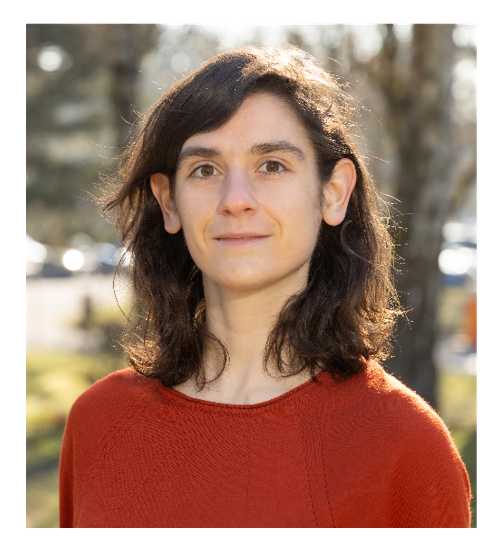

# Ariane Soret -- Personal Website

---

- [About Me](#about-me)
- [My Papers](#my-papers)
- [YouTube Videos](#youtube-videos)

---

##   About Me 
I am a research scientist at the [University of Luxembourg](https://www.uni.lu/fstm-en/research-departments/department-of-physics-materials-science/), in the group of [Massimiliano Esposito](https://sites.google.com/site/massimilianoespositogennaro/home). My research interests include quantum thermodynamics, quantum optics, mesoscopic physics, statistical mechanics and many-body quantum systems. The common denominator of my research accross these fields is the study of light far from equilibrium, in classical, semi-classical and quantum models. My latest works focus on adapting the methods of stochastic thermodynamics to study energy fluctuations of photons interacting with quantum systems, in particular in far from equilibrium regimes and non linear regimes.  

A complete CV in <a href="/CV_Soret_english.pdf"> PDF.

---

## Papers

Here are some of my papers which illustrate each of my research interests, past and present. The complete list of my publications is on my [Google Scholar](https://scholar.google.com/citations?view_op=list_works&hl=fr&hl=fr&user=u_wKph8AAAAJ) page.

- [AS, V. Cavina, M. Esposito, "Thermodynamic consistency of quantum master equations"](https://journals.aps.org/pra/abstract/10.1103/PhysRevA.106.062209)
- [AS, K. Le Hur, E. Akkermans, "Fluctuating forces induced by nonequilibrium and coherent light flow"](https://journals.aps.org/prl/abstract/10.1103/PhysRevLett.124.136803)
- [AS, O. Shpielberg, E. Akkermans, "Uncertainty relations for mesoscopic coherent light"](https://iopscience.iop.org/article/10.1088/1742-5468/ac3e6b/meta)
- [K. Le Hur, AS, F. Yang, "Majorana spin liquids, topology, and superconductivity in ladders"](https://journals.aps.org/prb/abstract/10.1103/PhysRevB.96.205109)
---

## YouTube Videos

Check out some of the videos on my YouTube channel:

These videos cover topics related to [mention the subjects or themes of your videos], providing valuable insights and discussions.

---

Feel free to explore more about my work on my personal webpage! You can also reach out to me via [email or contact information if desired].

Thank you for visiting!
